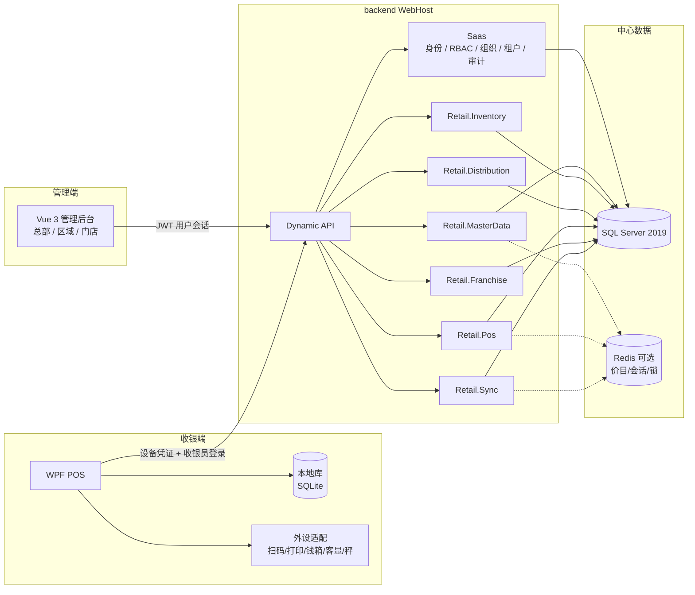
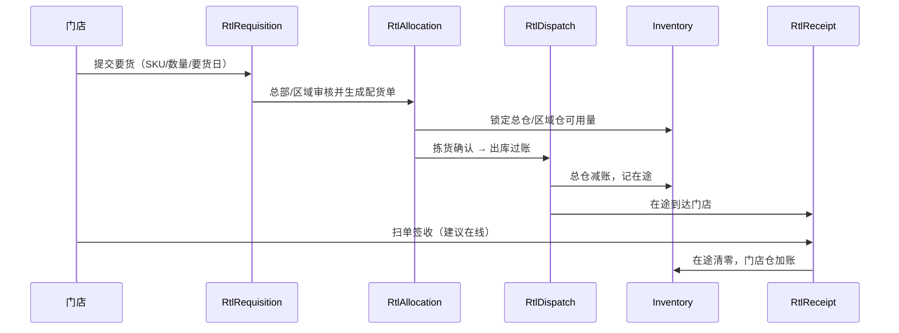

# 连锁零售 ERP 总架构

面向要落地的工程师。本文只定边界、链路和约束；类名与表名以可执行粒度给出，**尚未写业务代码**。实现时仍走现有模块装配（`XiHanModule` + `[DependsOn]`）、Dynamic API、SqlSugar、权限码与 `PageRegistry`。

配套：[模块边界](./modules) · [WPF POS](./pos-wpf) · [索引](./)

## 背景与约束

| 约束 | 含义 |
| --- | --- |
| 基于现有 monorepo 扩展 | 不推翻 Saas / RBAC / 多租户 / 审计；零售以新业务模块挂到 `WebHost` |
| 业态 | 连锁零售，约千家门店；直营 + 加盟；总部统一配送；支持离线收银 |
| 中心库 | **SQL Server 2019** |
| 收银 | **WPF 桌面客户端**（对接外设），不是 Web POS |
| 管理后台 | 现有 Vue 3 前端，服务总部 / 区域 / 门店管理人员 |
| 现状 | 后端 .NET 10；一等模块：Saas、CodeGeneration、AI、Workflow、Printing、Chat；前端 Vue3；文档 VitePress |

不要使用 `backend/src/business` 里空的 ERP 脚手架作为本方案落点。那些项目代表预留边界，模块注册基本为空。零售按 [二次开发 · 配方 B](../backend/development) 新建 `modules/XiHan.BasicApp.Retail.*`。

---

## 目标与非目标

### 目标

1. 在一套租户内管约千家门店的商品、价格、多仓库存、统配与收银流水。
2. 直营店与加盟店共用主档与统配链路，用门店类型 + 数据权限区分经营与结算口径。
3. 总部 / 区域 / 门店管理人员继续用 Vue 后台；门店收银员只用 WPF POS。
4. 收银允许断网：本地成单、支付成功单不丢，恢复网络后幂等补传。
5. 库存与财务相关的最终校验在服务端 SQL Server；POS 本地库只是门店缓存与离线队列。

### 第一期（MVP）不做什么

下列能力**第一期不做**，避免把底座做成「大而全 ERP」。分期见文末。

| 不做 | 原因 |
| --- | --- |
| 电商 / O2O / 直播带货 / 全渠道库存预占 | 渠道模型会污染 SKU 与锁库；第二期以后单独立项 |
| 会员积分、储值卡账本、CRM 营销 | 可后续模块；MVP 收银只记「会员号快照」可选字段 |
| 门店自采、供应商直送门店 | 与「总部统配」冲突；开通前必须产品拍板 |
| 生产 / BOM / 加工间 | 零售标准品为主；称重品只做条码+称重外设，不做车间 |
| 完整财务总账 / 税务申报 | 本系统出进销存与结算明细，凭证丢给财务系统 |
| 加盟股权、多品牌加盟商独立租户（默认不做） | 默认加盟商是租户内主体；若要独立租户见「待产品确认」 |
| Web POS / 浏览器收银 | 外设与离线不在浏览器里做；管理端打印继续用现有 Printing 模块 |
| 默认一店一库 | MVP 同库 `TenantId + StoreId`；分库是可选演进 |
| 把零售单据塞进 Saas | Saas 不承载要货/配货/小票 |

---

## 假设与待产品确认

落地前把下表变成书面规则。文档按「假设」写默认实现；「待确认」不得在代码里写死成唯一路径，必须做成配置或策略接口。

### 假设（可作为默认实现）

| ID | 假设 | 对实现的影响 |
| --- | --- | --- |
| A1 | **一个租户 = 一个连锁品牌/集团**。多品牌用多租户，而不是在一个租户里再套品牌树。 | `SysTenant` 继续当隔离边界；零售实体一律带 `TenantId` |
| A2 | **直营店与加盟店在同一租户**。加盟商是租户内的合作主体（`RtlFranchisee`），不是独立 `SysTenant`。 | 数据权限按门店/加盟商过滤，不靠切租户隔离加盟 |
| A3 | 组织树复用 `SysDepartment`（总部 → 区域 → 门店部门），门店业务实体 `RtlStore` **一对一挂到叶子部门**。 | 数据范围 `DepartmentAndChildren` 可覆盖区域经理看下属店 |
| A4 | 总部统配是唯一补货主路径；门店仓只接收配送入库 + 盘点 + 调拨（调拨第一期可只做店间、且须总部审批）。 | `Retail.Distribution` 是库存增加的主入口 |
| A5 | POS 售价取「生效价目」快照写入小票行；事后改价不影响已成交行。 | 小票行存 `PriceListId`、`ListPrice`、`ActualPrice` |
| A6 | 中心库存不允许「无单据改账面」；盘点生成盘盈盘亏单。 | 库存流水必须有 `SourceDocType + SourceDocId` |
| A7 | 收银小票主键在中心库用雪花 `Basic_Id`；门店另有 `LocalTicketNo` 供离线展示与幂等。 | 同步键是幂等键，不是本地流水号本身 |
| A8 | 表前缀 `Rtl_`、实体 `RtlXxx`，不占用内核 `Sys_`。 | DBA 可按前缀做文件组、备份与归档 |

### 待产品确认（实现时用策略/配置，禁止写死）

| ID | 问题 | 建议默认（可改） | 卡住哪些模块 |
| --- | --- | --- | --- |
| P1 | 是否一品多价（门店价、会员价、促销价、加盟配货价）？ | 预留价目表：零售价目 + 配货价目；MVP 先做「SKU 标准零售价 + 门店覆盖价」 | MasterData / POS / Franchise |
| P2 | 是否允许负库存？ | 直营默认不允许；加盟仓可按合同配置；POS 离线超卖进「库存异常单」，上线后由服务端裁定 | Inventory / POS / Sync |
| P3 | 加盟结算周期（日结 / 周结 / 月结）？费用项有哪些？ | 先做月结 + 配货货款；加盟金/保证金只建台账不自动计提 | Franchise |
| P4 | 加盟商能否登录看其它加盟商门店？ | 不能。加盟商账号数据范围 = 其合同下门店 | Franchise / 数据权限 |
| P5 | 称重品计价：店内秤条码 vs 收银称重？ | 外设抽象两种都留；主档用 `SaleMode=Each/Weight` | POS / MasterData |
| P6 | 退货是否必须原单？是否允许跨店退？ | MVP：原单退、本店退；跨店退待确认 | POS |
| P7 | 日结是否必须缴款差异为 0 才能关账？ | 允许差异，记长短款，须店长权限 | POS |
| P8 | 要货是否允许改总部建议量？是否有最低起订？ | 允许改，受配货配额与箱规约束 | Distribution |
| P9 | 千店后是否按区域拆库？ | 不作为 MVP；预留 `StoreId` 在所有流水索引最左前缀附近 | 部署 |
| P10 | POS 离线最长允许几天？ | 建议 72 小时；超时只许查询历史、不许新开单 | Sync / POS |
| P11 | 支付渠道：现金 / 银行卡 / 扫码聚合 / 储值？ | MVP：现金 + 一种扫码（在线）；离线仅现金（或已预授权的标记） | POS |
| P12 | 是否启用 Edition 功能门控（直营版 / 加盟版）？ | 建议用现有 `SysTenantEdition` 控制模块权限白名单 | Saas |

---

## 逻辑架构

管理后台、API、WPF POS、本地库、SQL Server、可选 Redis 的职责如下。



ASCII 对照（文档站若未启用 mermaid 时仍可读）：

```text
┌──────────────┐         ┌─────────────────────────────────────────────┐
│ Vue 管理后台  │         │  WPF POS                                      │
│ 总部/区域/门店 │         │  UI → 应用服务 → 本地库(SQLite) → 同步后台     │
└──────┬───────┘         │                 ↘ 外设适配层                   │
       │ JWT 用户         └───────────┬───────────────────────────────────┘
       │                              │ 设备凭证 + 收银员登录
       ▼                              ▼
┌──────────────────────────────────────────────────────────────────────┐
│ XiHan.BasicApp.WebHost  （Dynamic API，无 Controller）                 │
│  Saas │ MasterData │ Inventory │ Distribution │ Pos │ Franchise │ Sync │
└───────────────────────────────┬──────────────────────┬───────────────┘
                                ▼                      ▼
                     SQL Server 2019            Redis（可选）
                     事实源 / 单据 / 流水         价目快照 / 设备会话 / 锁
```

### 各层职责（一句话）

| 组件 | 负责 | 不负责 |
| --- | --- | --- |
| Vue 管理后台 | 主档、库存、统配、加盟、报表、设备治理 | 实时收银、驱动外设、离线成单 |
| WPF POS | 前台售卖、外设、离线队列、交班 | 改总部主档、加盟对账、跨店库存调拨审批 |
| WebHost + 模块 | 鉴权、单据状态机、库存校验、幂等收单 | 直接操作 POS 本机硬件 |
| POS 本地库 | 商品快照、购物车/离线单、同步水位 | 作为全公司库存账本 |
| SQL Server 2019 | 唯一账面事实源 | 门店断网时的实时写入（此时写本地库） |
| Redis（可选） | 价目/SKU 只读缓存、设备会话、配货锁、幂等键短 TTL | 持久化单据（进程挂了以 SQL 为准） |

Redis 不是硬依赖：单机/小规模可关缓存，走 SQL。千店建议开，减轻价目与会话读压力。现有 WebHost 已有 Redis 健康检查，零售模块复用同一套 `XiHan` 缓存配置即可。

---

## 与 XiHan.BasicApp 的关系

```text
                    ┌─────────────────────────────┐
                    │  零售业务模块 Retail.*        │  ← 本方案新增
                    │  单据 / 库存 / POS / 同步     │
                    └──────────────▲──────────────┘
                                   │ DependsOn
┌──────────────────────────────────┴──────────────────────────────────┐
│ Saas：SysUser / 角色权限 / 部门闭包 / SysTenant / 审计日志 / 编号规则   │
│ Printing / Chat / Workflow / AI / CodeGeneration：按需 DependsOn      │
└──────────────────────────────────▲──────────────────────────────────┘
                                   │
                    Core + Web.Core + XiHan.Framework
```

### 复用 Saas（必须）

| 能力 | 零售怎么用 |
| --- | --- |
| 身份 | 总部运营、区域经理、店长、收银员都是 `SysUser`；邮箱仍是全平台登录标识 |
| RBAC | 权限码新增 `rtl:*`；角色如「总部商品员」「配货员」「店长」「收银员」「加盟商」 |
| 组织 | `SysDepartment` 表达总部/区域/门店部门；闭包表给区域数据范围 |
| 审计 | 写操作继续走现有操作日志 / 实体 Diff；小票另有业务流水，不替代审计 |
| 多租户 | 零售实体继承 `BasicAppFullAuditedEntity`（或聚合根），`TenantId=0` 仅平台模板 |
| 编号 | 复用系统编号规则（`setting/numbering`）生成要货单号、配货单号；POS 本地单号由门店号+日期+序列组成 |
| 文件 | 合同附件、盘点附件走现有文件模块 |
| 工作流 | 大额调拨、加盟合同审批可挂 Workflow，MVP 可用状态机 + 权限代替 |

### 零售模块扩展（必须独立）

零售单据、库存账、价目、设备、同步水位**全部放 `Retail.*`**。禁止：

- 在 `SysUser` 上堆「收银班次」列（班次是 `RtlPosShift`）
- 用 `SysDepartment` 直接当仓库（仓是 `RtlWarehouse`，可关联部门）
- 把小票写进 Saas 消息/聊天表
- 修改 Framework / Core 来迁就 POS

卫星模块关系与现有一致：**Retail.* 依赖 Saas，彼此不循环依赖**。需要互调时走领域事件或应用层编排（例如配货出库发布事件，Inventory 记账）。`Retail.Sync` 可引用 Pos/MasterData 的契约，但不要反向引用 WPF 工程。

Printing 模块是 **Vue 管理端浏览器打印**（模板 + electron-hiprint）。门店小票打印走 WPF 外设适配，不复用 hiprint。配货单/对账单可在 Vue 里用 Printing。

---

## 门店模型

### 品牌 / 租户

```text
平台（TenantId=0）
 └ 租户 A = 某连锁品牌     ← 默认「一品牌一租户」（假设 A1）
      ├ 组织树 SysDepartment
      ├ 门店 RtlStore
      ├ 仓 RtlWarehouse
      └ 加盟商 RtlFranchisee（可空，仅加盟体系）
```

平台超管可切租户代运维，与现有 `SwitchTenant` 相同。零售数据过滤器必须同时认 `TenantId`（框架自动）和 `StoreId`（零售模块自己加）。

### 组织树

建议部门形态（严格单父树，闭包表已存在）：

```text
总部
 ├ 华北区
 │   ├ 北京一店（叶子，挂 RtlStore）
 │   └ 天津一店
 ├ 华东区
 │   └ …
 └ 物流中心（可挂总仓，不是门店）
```

| 对象 | 落点 | 说明 |
| --- | --- | --- |
| 总部 / 区域 | `SysDepartment` | 区域经理数据范围 = `DepartmentAndChildren` |
| 门店 | `RtlStore.DepartmentId → SysDepartment` | 一个叶子部门对应一个营业门店 |
| 岗位 | `SysPosition` | 店长、收银、理货；不参与数据范围 |
| 人员归属 | `SysUserDepartment` | 收银员主部门 = 所在门店部门 |

### 直营 vs 加盟

| | 直营 | 加盟 |
| --- | --- | --- |
| `RtlStore.StoreMode` | `Direct` | `Franchise` |
| 货权 | 公司库存 | 默认「配货买断到加盟商」（待 P3 确认；也可做代销） |
| 零售价 | 总部价目，门店可被禁止改价 | 可按合同允许有限加价（P1） |
| 要货 | 向总仓/区域仓要货 | 同样走统配，结算走 Franchise |
| 人员 | 公司员工 `SysUser` | 门店员工仍建议是本租户 `SysUser`，数据范围绑加盟门店 |
| 隔离 | 按部门/门店 | 额外按 `FranchiseeId` 切断跨加盟商可见性 |

`RtlFranchisee`（加盟商）1 对多 `RtlStore`。没有加盟商记录的门店不得设为 `Franchise`。

### 仓（总仓 / 区域仓 / 门店仓）

| 类型 `WarehouseType` | 谁用 | 库存含义 |
| --- | --- | --- |
| `HqDc` 总仓 | 统配出库起点 | 公司存货 |
| `RegionDc` 区域仓 | 可选中转 | 公司存货；千店后可按区部署 |
| `Store` 门店仓 | 每店至少一仓 | 直营=公司存货；加盟=按合同（买断/代销） |

规则：

- SKU 库存粒度：`(TenantId, WarehouseId, SkuId)`，可加 `BatchNo`/`Expiry`（MVP 可不启用批次）。
- 门店 POS 扣减的是该店 `Store` 仓；没有仓就禁止开业。
- 在途不是「一个虚拟仓里的糊涂账」，而是配货出库单上的 `InTransitQty`，签收时转入门店仓。

---

## 数据与部署

### SQL Server 2019 作为中心库

连接落在现有 `XiHan:Data:SqlSugarCore`，`DbType` 改为 `SqlServer`。示例（密码走环境变量）：

```json
{
  "ConfigId": "Default",
  "DbType": "SqlServer",
  "ConnectionString": "Server=.;Database=XiHanRetail;User Id=app;Password=***;TrustServerCertificate=True;Encrypt=True;",
  "SlaveConnectionConfigs": []
}
```

兼容性注意：

- 实体列名继续 `snake_case`（`Tenant_Id`、`Basic_Id`），与现有 SqlSugar 约定一致；在 SQL Server 上会生成对应列，查询不要手写假定 PostgreSQL 语法。
- 布尔用 `bit`；时间继续 `DateTimeOffset`（`datetimeoffset`）。
- 分页走现有 `[HttpPost]` 查询服务，不要用 `OFFSET` 深翻小票——按 `BusinessDate + Basic_Id` 键集分页。
- 千店流水表用 SqlSugar **按月分表**（与 `Sys_Login_Log_{yyyyMM01}` 同模式）。

### 千店下的数据范围（不是一上来就分库）

默认 **一租户一库同表**，靠列隔离：

```text
所有零售表：Tenant_Id
门店私有表：再加 Store_Id
库存表：Warehouse_Id（仓已归属门店或总部）
流水表：Tenant_Id + Store_Id + Business_Date
```

必须建的索引（示意）：

| 表 | 索引 |
| --- | --- |
| `Rtl_Pos_Ticket` | `(Tenant_Id, Store_Id, Business_Date, Basic_Id)`；唯一 `(Tenant_Id, Idempotency_Key)` 且含 `Is_Deleted` |
| `Rtl_Pos_Ticket_Line` | `(Tenant_Id, Ticket_Id)` |
| `Rtl_Stock` | 唯一 `(Tenant_Id, Warehouse_Id, Sku_Id, Is_Deleted)` |
| `Rtl_Stock_Ledger` | `(Tenant_Id, Warehouse_Id, Sku_Id, Created_Time)` ；按月分表 |
| `Rtl_Requisition` | `(Tenant_Id, Store_Id, Status, Created_Time)` |

查询默认带 `StoreId` 过滤。总部报表禁止对流水表做全表 `GROUP BY`，走汇总表。

### 读写分离与汇总表

现有 SqlSugar 已支持 `SlaveConnectionConfigs`：SELECT 走从库，写与事务走主库。建议：

| 流量 | 去向 |
| --- | --- |
| POS 同步写入、库存记账、统配过账 | 主库 |
| 管理端列表、对账查询 | 从库（可接受秒级延迟） |
| 看板 / 昨日销售 | **汇总表**，不要扫当日以外的流水 |

建议汇总（由定时任务或过账后异步生成，失败可重跑）：

| 表 | 粒度 | 用途 |
| --- | --- | --- |
| `Rtl_Store_Sale_Daily` | 租户+店+营业日 | 门店日销、客单、来客数 |
| `Rtl_Sku_Sale_Daily` | 租户+店+SKU+营业日 | 要货建议、滞销 |
| `Rtl_Stock_Snapshot_Daily` | 租户+仓+SKU+日 | 账面核对、加盟盘货 |
| `Rtl_Sync_Device_Watermark` | 设备 | 同步滞后监控 |

汇总任务挂现有调度模块，租户上下文必须带上（参考 Saas 任务的多租户写法）。

### 不强制一店一库（可选演进）

| 阶段 | 拓扑 | 何时考虑 |
| --- | --- | --- |
| 现在 | 单库（可主从）+ `StoreId` 过滤 + 流水月分表 | 千店、单店日单量万级以下优先这个 |
| 演进 1 | 报表库 / 只读副本 | 总部分析拖垮收银写入时 |
| 演进 2 | 按区域分库（华北/华东各一业务库）+ 租户级路由 | 单库 CPU/日志成为瓶颈；需要改 `ConfigId` 路由 |
| 演进 3 | 超大门店独立库 | 极少数店；成本高，同步与跨店退货变复杂 |

`SysTenant` 已有独立库字段（`IsolationMode=Database`）。那是 **租户级** 分库，不是门店级。不要用「每店一个 Tenant」来模拟一店一库——加盟商、区域报表、统配都会断。

POS 本机 SQLite 更不是分库方案：它只服务一台收银机。

---

## 统配主链路

总部统一配送的主路径只有这一条。其它入库（盘盈、调拨）不得冒充配货。



```text
要货 RtlRequisition        门店发起，状态 Draft → Submitted → Approved/Rejected → Closed
        ↓ 按行生成
配货 RtlAllocation         总部/区域仓执行，可改量、可拆单、可缺货关闭行
        ↓ 拣货完成
出库 RtlDispatch           过账：来源仓 -qty；生成在途 RtlInTransit
        ↓ 运输
签收 RtlReceipt            实收可 ≤ 在途；差异行生成 RtlReceiptDiff
        ↓
门店仓入库                 在途关闭；加盟则同时记应付（Franchise 后期）
```

### 状态与库存动作

| 单据 | 关键状态 | 库存 |
| --- | --- | --- |
| 要货 | `Draft/Submitted/Approved/Cancelled` | 不记账，最多记「要货占用」（可选，MVP 可不占用） |
| 配货 | `Open/Picking/Dispatched/Closed` | `Open→Picking` 时对来源仓 **锁定** `QtyAllocated` |
| 出库 | `Posted` | 释放锁 + 减可用；增加在途 |
| 在途 | `Shipping/PartialReceived/Received/Lost` | 不是独立 SKU 账，是出库单聚合 |
| 签收 | `Draft/Posted` | 门店仓 + 实收；差异走盘亏/在途损失（规则待产品确认） |

### 实现要点

- 全部过账同一 UoW，失败整单回滚。
- 行必须有 `SkuId`、配货价、零售价快照（加盟结算要用配货价）。
- 签收**建议在线**（见 POS 文档）：要写中心库存，不能只记在 SQLite。
- 直营与加盟共用这套单据；`StoreMode` 只影响结算事件，不影响物流状态机。

---

## 安全

### 门店数据权限

在现有权限码 + 数据范围之上，零售查询必须再套一层 **门店范围**：

```text
权限码 rtl:ticket:read     →  能不能调接口
数据范围 DepartmentAndChildren →  能看哪些部门（区域）
门店范围 StoreId IN (...)  →  能看哪些店（由部门叶子 ∩ 用户授权店 得出）
加盟范围 FranchiseeId = me →  加盟商账号不得看其它加盟商
```

落地建议：

1. 角色数据范围继续用 Saas（区域经理 = 部门及下级）。
2. 零售 QueryService 把用户可访问部门展开为 `StoreId` 列表（门店挂在叶子部门上），缓存短 TTL。
3. 收银员角色数据范围建议 `DepartmentOnly` 或更窄的「仅本店」自定义范围。
4. 超管 / 总部角色 `All` 仍受 `TenantId` 约束，不能跨租户。

不要把 `StoreId` 让前端随便传了就算数：服务端以令牌里的用户范围为准，请求里的 `storeId` 只能是范围内的过滤条件。

### 加盟商隔离

| 规则 | 做法 |
| --- | --- |
| 不能看其它加盟商进销存、要货、结算 | 所有加盟相关查询带 `FranchiseeId` |
| 不能改总部主档（SKU、标准价） | 不授 `rtl:sku:update`；只读价目 |
| 合同与费用仅总部财务 + 该加盟商 | `rtl:franchise-contract:*` 分 read-own / manage |
| 直营人员默认不看加盟结算明细 | 单独权限码，不要绑在「库存查询」上 |

假设 A2 下，**不要**给每个加盟商开一个 `SysTenant` 来隔离——统配、主档、价目会被迫做成跨租户同步。若产品坚持加盟商独立租户（P4 的反方案），需要单独设计「品牌主档下发」，工作量不在本架构 MVP 内。

### POS 设备 / 门店凭证

POS 不是浏览器用户会话那么简单，采用 **双凭证**：

| 凭证 | 代表谁 | 用途 |
| --- | --- | --- |
| 设备凭证 | 已注册的收银机（`RtlPosDevice`） | 证明「这台机器属于某租户某门店」；吊销即可封机 |
| 收银员登录 | `SysUser` | 证明「谁在收款」；权限、班次、审计 |

流程概要（细节见 [WPF POS · 认证](./pos-wpf#与后端-api-的认证)）：

1. 总部在 Vue 注册设备：绑定 `StoreId`，下发 `DeviceId + DeviceSecret`（或一次性激活码）。
2. POS 用设备凭证换取 **设备访问令牌**（范围仅限该店 POS/Sync API）。
3. 收银员用账号密码（可加本机 PIN）登录；服务端校验该用户属于该店部门。
4. 业务请求同时带设备令牌与用户令牌（或一个合并令牌，claims 含 `device_id` + `store_id` + `user_id`）。
5. 密钥存 Windows DPAPI / 本机加密，不进 Git、不进小票。

设备丢失：后台吊销设备 → 已发出牌作废 → 本地仅允许导出离线单到 U 盘由店长到联网机补传（该流程可第二期再做，但吊销必须一期就有）。

管理端 JWT 与 POS 令牌不要混用同一 Audience：POS API 单独一组权限码，避免收银令牌能调租户设置。

---

## 分期

```text
① MVP → ② 统配 → ③ 加盟结算 → ④ 离线 POS 强化 → ⑤ 规模化
```

### ① MVP

**范围**

- MasterData：SKU、条码、门店、门店仓、标准零售价（门店覆盖价可选）
- Inventory：账面库存、销售扣减、简单盘点（直营）
- Pos（服务端）：在线开单、支付登记、本店原单退、班次日结
- Vue：商品/门店/库存/小票查询页面
- Saas：角色与 `rtl:*` 权限种子、门店部门

**验收**

- 直营店在线收银能出小票并扣库存
- 店长能盘点并过账
- 区域经理只能看到下属店数据
- 不安装 WPF 也能用临时 HTTP 客户端测 API（WPF 可并行起骨架，但不作为 MVP 门禁）

**不做**：加盟结算、统配单据、离线补传、外设适配。

### ② 统配

- Distribution 全链路：要货 → 配货 → 出库 → 在途 → 签收
- 库存锁定与在途
- Vue 配货工作台（总仓视角）
- 签收建议强制在线

### ③ 加盟结算

- Franchise：合同、费用项、配货单价、对账单
- 签收过账时记应付（按 P3 周期出账）
- 加盟商登录范围锁定

### ④ 离线 POS 强化

- `clients/pos-wpf` 可安装版本
- SQLite、同步队列、幂等、冲突策略
- 外设接口 + 至少一种打印机与一种扫码实现
- 设备注册 / 吊销

### ⑤ 规模化

- 流水月分表、日汇总表、从库
- 同步水位监控、失败补传治理
- 评估区域分库（非默认）
- POS 性能：本地 SKU 全量/增量、启动秒开

每期结束只允许「文档中的待确认项」被产品签字，不允许偷偷扩大范围（例如顺便做会员）。

---

## 落地时的工程检查清单

对照现有二次开发约定，新模块不要漏接线：

1. 新建 `modules/XiHan.BasicApp.Retail.*`，`[DependsOn(typeof(XiHanBasicAppSaasModule))]`
2. `WebHost` 的 `[DependsOn]` 增加零售模块
3. 权限码常量 + 权限定义种子；种子 `Order` 使用 **400–499** 段（Saas 10–37，CodeGeneration 100+，AI 200+，Workflow 300+）
4. 菜单走模块内 `PageRegistry`；前端补 `frontend/src/views/retail/**` 与 `api/modules/retail/**`
5. 实体继承 `BasicAppFullAuditedEntity` / 流水用 `BasicAppCreationEntity`；软删唯一索引包含 `IsDeleted`
6. 写侧 `[UnitOfWork(true)]` + `[PermissionAuthorize]`；分页查询 `[HttpPost]`
7. 不在 `Program.cs` 里手写零售中间件

WPF 工程不进 `frontend/`，不进 `WebHost` 进程。
