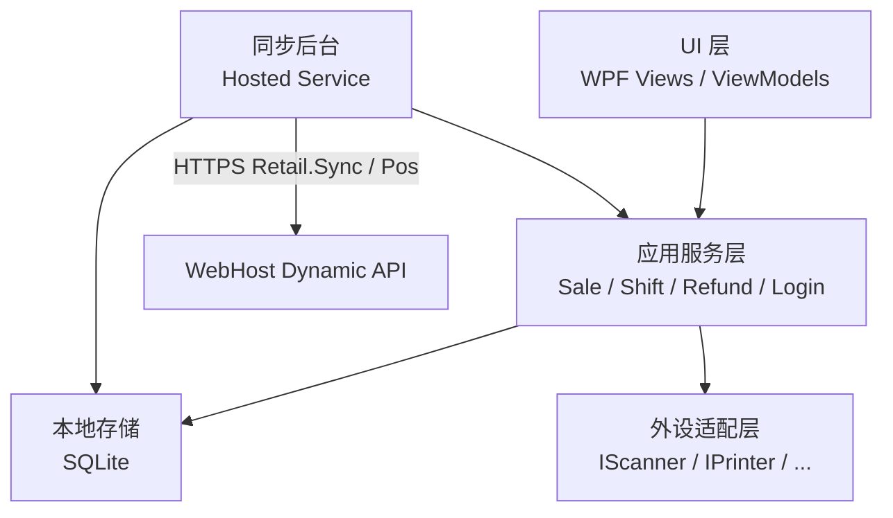
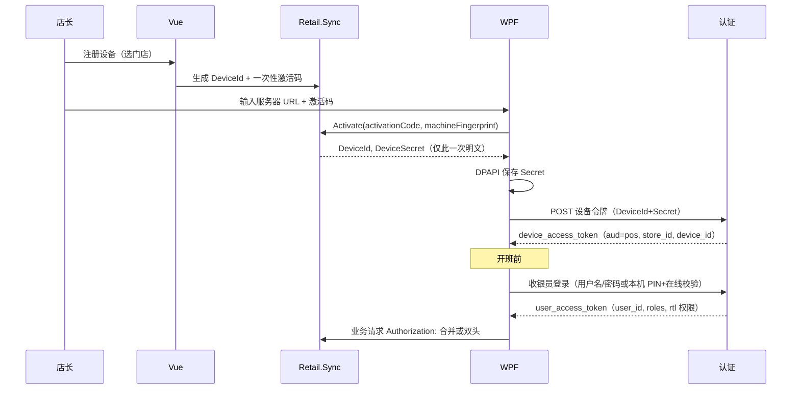

# WPF POS：离线同步与外设对接

收银前端是 **WPF 桌面客户端**，不是 Web POS。工程落点：`clients/pos-wpf/`（理由见 [模块边界](./modules#wpf-客户端目录clientspos-wpf)）。服务端收银 API 在 `XiHan.BasicApp.Retail.Pos`，设备与补传在 `Retail.Sync`。

本文面向要实现客户端的工程师：进程怎么切、本地库存什么、哪些能离线、同步怎么做到「支付成功单不丢」、外设怎么抽象、如何认证。

---

## 为何用 WPF

| 诉求 | Web POS 的问题 | WPF 的做法 |
| --- | --- | --- |
| 外设 | 浏览器拿不到稳定的 USB/串口/厂商 SDK；静默打印依赖本机 hiprint，仍不是称重/钱箱的完整方案 | 用串口、USB HID、厂商 DLL、OPOS/UPOS 均可；适配层隔离 |
| 前台稳定性 | 误刷新、浏览器更新、杀毒注入、内存页被回收 | 独立进程，收银员无地址栏；异常隔离在应用服务层，UI 可恢复购物车 |
| 离线 | Service Worker 对打印/钱箱/本地账本不可靠，且难与 Windows 驱动共存 | 本机 SQLite + 后台同步线程；断网时仍能开钱箱打小票 |
| 门店 IT | 收银机多为 Windows，已装驱动 | 目标框架建议 `net10.0-windows`，与后端 .NET 10 同一代 |

管理端打印仍用现有 Printing 模块（浏览器 / electron-hiprint）。**小票、客显、钱箱只走 WPF。** 不要把 Vue 管理壳和 POS 合成一个 Electron 套娃。

假设：门店收银 PC 为 Windows 10/11 x64。Linux 收银不在范围内。

---

## 进程架构

一个 POS 进程内分五层，**单向依赖**：UI → 应用服务 → 本地存储 / 外设；同步后台只依赖应用服务与本地存储，不直接绑控件。



```text
clients/pos-wpf/
  XiHan.BasicApp.Pos.Desktop          # WPF：窗口、快捷键、班次屏、锁屏
  XiHan.BasicApp.Pos.Application      # 用例：开单、改数量、结算、退货、交班
  XiHan.BasicApp.Pos.LocalData        # SQLite 访问、迁移、仓储
  XiHan.BasicApp.Pos.Sync             # 队列泵、水位、重试
  XiHan.BasicApp.Pos.Peripherals      # 接口 + 厂商适配
  XiHan.BasicApp.Pos.Contracts        # 与服务端对齐的 DTO（可选共享）
```

| 层 | 负责 | 不负责 |
| --- | --- | --- |
| **UI** | 布局、快捷键 F1–F12、客显文案、阻塞式结算对话框 | 拼 SQL、直接 `FileStream` 打串口、自己算可用库存 |
| **应用服务** | 购物车不变量、价格快照、权限（本机缓存的权限码）、调用外设 | 知道同步 HTTP 细节；知道 Epson 指令 |
| **本地存储** | 事务写入购物车/离线单/水位；迁移版本 | 业务决策（例如能不能退货） |
| **同步后台** | 定时/网络恢复触发；批量 POST；更新水位；死信告警 | 弹窗；改购物车中间态 |
| **外设适配** | 把「切纸」「开钱箱脉冲」落到具体驱动 | 改订单金额 |

实现注意：

- 同步后台用 `BackgroundService` 或独立 STA 之外的线程。WPF 是 STA：串口事件回 UI 必须 `Dispatcher`。扫码入车在 UI 线程排队，避免两个扫码并发改同一购物车。
- 未成交购物车只在内存 + 本地 `Cart` 表；崩溃恢复从本地载入。不要每加一行就调中心 API。
- 配置（服务器地址、设备 Id、外设 COM 口）放本机加密配置，不进安装包默认密钥。

---

## 本地库建议

**默认：SQLite**（单文件，例如 `%ProgramData%\XiHan\Pos\{DeviceId}\pos.db`）。

| | SQLite | SQL Server LocalDB |
| --- | --- | --- |
| 安装 | 随应用分发，无实例服务 | 要装 LocalDB/Express，门店镜像麻烦 |
| 离线 | 天然单机 | 本机服务挂了收银一起挂 |
| 运维 | 关程序拷贝文件即备份 | 还要 bak |
| 与中心库相似 | SQL 方言不同 | T-SQL 接近，但无必要：本地 schema 本来就瘦 |
| 并发 | 一台收银机一库足够 | 过重 |

仅当公司强制「门店必须 SQL Server 全家桶」时再评估 LocalDB。本文按 SQLite 写 schema 要点。

### 本地存什么

| 数据 | 本地 | 中心 SQL Server |
| --- | --- | --- |
| SKU / 条码 / 价目快照 | 有，带 `Version` | 事实源 |
| 购物车、未完成结算 | **仅本地** | 无 |
| 已成交离线单 / 支付行 | 有，待同步 | 同步成功后为事实源 |
| 同步水位、失败次数 | 有 | `Rtl_Sync_Watermark` 镜像 |
| 班次（未交班） | 有 | 交班成功后为事实源 |
| 库存可用量 | **参考缓存**，可过期 | 事实源 |
| 要货 / 配货 / 加盟结算 | 无（或只读已下载的到货预告） | 事实源 |
| 用户账号哈希（离线 PIN） | 有限缓存，有 TTL | `SysUser` 事实源 |
| 设备密钥 | DPAPI 加密文件，可另存哈希到库 | 服务端只存哈希/密文 |

### 建议表（本地）

```text
local_sku              sku_id, barcode, name, sale_mode, price, tax, version, updated_at
local_price_rule       可选：门店覆盖价
local_cart / _line     未成交
local_ticket / _line / _pay    已成交，sync_status = Pending/Syncing/Done/Dead
local_shift            开班、现金抽屉预估
local_sync_queue       payload_json, idempotency_key, attempts, last_error
local_watermark        dataset, token  -- 如 masterdata=20260318T120000Z:seq
local_cashier_cache    user_id, pin_hash, perm_codes_json, expire_at
```

本地 **不要** 复制整份 `Rtl_Stock_Ledger`。最多存「本机上次同步的可用量」用于提示，扣减以服务端为准。

备份：日结后复制 `pos.db` 到店长 U 盘或总部 SMB（可选）。文件可能含离线单，按门店保密策略管理。

---

## 离线能力边界

断网不是「全部功能的缩小版」，而是一张白名单。

### 可离线（必须能在无 API 时完成）

| 能力 | 条件 |
| --- | --- |
| 收银开单 | 本地有 SKU 快照；设备未过离线宽限期（建议 72h，待确认 P10） |
| 现金支付 | 必做 |
| 扫码支付 | **默认不可离线**（见下）；除非聚合商支持离线码且产品签字 |
| 打小票、开钱箱、客显 | 纯本机外设 |
| 受限退货 | 仅能退 **本机已有原单** 且未超过时限；不能跨机查总部历史 |
| 交班 / 日结（本机） | 先在本地关班；上线后补传；长短款以本地清点为准 |
| 查看本机今日小票 | 本地查询 |

### 建议在线（无网就禁用或只读）

| 能力 | 原因 |
| --- | --- |
| 主档大变更（新建 SKU、改标准价、改条码） | 避免多店冲突；改价必须中心生效再下发 |
| 统配签收确认 | 直接改中心库存与在途；离线签收易把在途打乱 |
| 加盟结算、对账确认 | 财务单据，不允许门店离线「确认应付」 |
| 跨店退货、无原单退货 | 无法校验 |
| 调拨审批、要货提交 | 可在 Vue 或 POS 在线菜单做，不进离线队列 |
| 设备激活 / 密钥轮换 | 必须打到 Sync |
| 改门店类型、改加盟商 | 总部作业 |

### 离线扫码支付

默认：**离线只收现金**（或预授权标记，不上账为「已支付」）。把第三方支付做成本地成功会导致对账地狱。若产品要求离线扫码，必须单独做「支付渠道离线协议」，不在 MVP。

### UI 必须明示状态

标题栏三态：`在线` / `离线（剩余可收银 xx 小时）` / `只读（请联网同步）`。离线成交的小票角标「未上传」。店长能在本机看到失败队列，但不能点「丢掉支付成功单」。

---

## 同步协议要点

同步是 **设备推送 + 拉取**，不是把 SQLite 当 SQL Server 订阅复制。

### 标识

| 字段 | 谁生成 | 用途 |
| --- | --- | --- |
| `TenantId` | 激活时写入设备 | 所有请求 |
| `StoreId` | 设备注册绑定，**客户端不可改** | 服务端以设备表为准，忽略客户端乱填 |
| `DeviceId` | 注册时生成 | 吊销、水位、幂等空间 |
| `LocalTicketNo` | 本机：`店码+营业日+机号+序列` | 给人看、打印；**不是**全局主键 |
| `IdempotencyKey` | 本机在「支付成功」那一刻生成 UUID，之后永不改 | 中心唯一约束 `(TenantId, IdempotencyKey)` |
| `CashierUserId` | 登录用户 | 审计 |
| `BusinessDate` | 开班时取门店营业日（可与自然日不同，待产品确认） | 日结口径 |

服务端小票主键仍是雪花 `Basic_Id`。POS 只保存服务器返回的 id，用于退货关联。

### 版本与水位

两类水位分开：

1. **下行主档**：服务端 `Rtl_Masterdata_Version`（或按表的 `row_version` / `Modified_Time`）。POS 带 `If-None-Match` 或 `sinceVersion` 拉增量。全量仅在首次激活、版本跳跃、校验和不平。
2. **上行单据**：本地队列 FIFO。服务端对每个 `DeviceId` 记 `LastAcceptedSeq`（可选）以及每票幂等键。不要用「最后同步时间」当唯一判据——时钟会偏。

版本向量不必上 CRDT。实用做法：

```text
下行：serverSeq 单调递增（租户+门店维度）
上行：每票独立幂等键；队列 seq 仅用于本机重试顺序
```

时钟：所有过账时间以 **服务器 UTC** 为准；本地 `client_paid_at` 仅作参考。POS 开机应对时（NTP），但不信任它做冲突裁决。

### 上行包形状（示意）

```json
{
  "deviceId": "...",
  "storeId": "...",
  "schemaVersion": 1,
  "tickets": [
    {
      "idempotencyKey": "8f3c…",
      "localTicketNo": "0101-20260318-02-000123",
      "cashierUserId": "…",
      "clientPaidAt": "2026-03-18T10:11:12+08:00",
      "lines": [{ "skuId": "…", "qty": 2, "listPrice": 10.00, "actualPrice": 10.00, "priceListVersion": 88 }],
      "payments": [{ "method": "Cash", "amount": 20.00 }]
    }
  ],
  "shifts": [],
  "refunds": []
}
```

服务端处理：

1. 验设备令牌与 `storeId` 绑定。
2. 按票事务：已存在相同幂等键 → **原样返回上次结果**（不要第二次扣库存）。
3. 新票 → Pos 落单 → Inventory 扣减。
4. 部分失败策略见下节，响应里逐票 `accepted / acceptedWithException / rejected`。

`rejected` 仅用于 **结构非法、设备吊销、用户无权限、签名错误**。支付成功的合法票不得 `rejected` 后让客户端删除。

### 冲突策略

| 场景 | 策略 | 本地随后 |
| --- | --- | --- |
| 重复补传同一 `IdempotencyKey` | 幂等命中，返回已有 `Basic_Id` | 标 Done |
| **支付成功单** vs 任何校验失败 | **不可丢**。落票 `PostedWithException`，写 `Rtl_Pos_Exception` | 标 Done（业务已进中心），异常给总部 |
| SKU 已停用 / 条码不存在 | 仍收单，行记 `UnresolvedSku`，库存先不扣或扣到「待处理仓」 | 同上 |
| **库存不足**（以服务端为准） | 票留下；库存按策略：拒绝扣成负则记超卖异常，或允许负库存（P2） | 本地参考库存与中心对齐（以下发为准） |
| **价差**（POS 成交价 ≠ 中心当时价） | **成交价有效**（已收款）；记价差异常单供审计 | 不改已收金额 |
| 收银员已离职 | 仍收单，异常「无效收银员」；人已经收了客人的钱 | Done |
| 设备已吊销 | 整包 `rejected`；本地进入只读，提示店长换机补传通道 | 不得删除队列 |
| 交班金额与已同步票合计不符 | 接受交班，记长短款；不回滚小票 | Done |
| 主档下行与本地购物车冲突 | 未成交购物车：提示刷新价格；已成交票：走价差 | — |

一句话：**钱已经进抽屉的订单，中心必须 accept；库存和价格以「事后异常」消化，不以「丢单」消化。库存对错听服务端。**

### 补传

- 指数退避：10s / 30s / 2m / 10m，上限 15 分钟一次，直到成功。
- 网络恢复立即泵一次。
- `attempts` 超过 N 仍因 5xx 失败：保持 Pending，告警到 Vue 同步监控，**不是 Dead**。
- Dead 仅人工标记（重复垃圾包、测试数据）。支付成功票禁止 Dead。
- 批量大小：建议每包 ≤ 50 票或 ≤ 256KB，避免 IIS/Kestrel 限体。

### 下行主档

- 增量：SKU 变更、条码变更、门店价。删除用墓碑（`isDeleted`）而不是让 POS 猜。
- 强制全量：设备新激活、校验和失败、后台点「强制刷新」。
- 大变更（全量数万 SKU）：分块分页，POS 先写入 staging 表再原子切换，避免收银中途搜到一半目录。

---

## 外设抽象

UI 与应用服务只依赖接口。厂商差异全部进 `Peripherals` 实现。配置文件指定 `Provider` + 端口。

```csharp
public interface IBarcodeScanner
{
    event EventHandler<string> CodeReceived; // 已去掉后缀回车
    Task StartAsync(CancellationToken ct);
    Task StopAsync(CancellationToken ct);
}

public interface IReceiptPrinter
{
    Task PrintAsync(ReceiptDocument doc, CancellationToken ct);
    Task<bool> IsPaperOkAsync(CancellationToken ct);
}

public interface ICashDrawer
{
    Task OpenAsync(CancellationToken ct); // 通常经打印机 DK 口或独立 COM
    Task<bool> IsOpenAsync(CancellationToken ct); // 无状态钱箱可恒返回 unknown
}

public interface ICustomerDisplay
{
    Task ShowAsync(CustomerDisplayState state, CancellationToken ct);
    Task ClearAsync(CancellationToken ct);
}

public interface IScale
{
    Task<ScaleReading> ReadStableAsync(CancellationToken ct); // 稳定重量 + 是否零点
}
```

`ReceiptDocument` 是领域模型（行、合计、二维码、切纸），不是 ESC/POS 字节。适配器负责翻译。

### 按厂商适配（落地时加，不要在领域层 `if (brand)`）

| 接口 | 常见实现 | 备注 |
| --- | --- | --- |
| Scanner | USB HID 键盘楔、COM、厂商 SDK | 键盘楔要处理「焦点不在收银窗」时丢码：全局钩子或设备独占 |
| Printer | ESC/POS（爱普生兼容）、Windows 驱动、OPOS | 先做一种 ESC/POS；图片 LOGO 按能力降级 |
| CashDrawer | 打印机钱箱口 `ESC p`、独立继电器 | 开箱必须审计：谁、哪一票、是否无票开箱（须店长权限） |
| CustomerDisplay | COM 2×20 VFD、第二块 HDMI 屏 | 无客显时 `NullCustomerDisplay` |
| Scale | 串口持续输出、稳定标志位 | 仅 `SaleMode=Weight` 的 SKU 允许走秤；计件品禁止 |

驱动加载失败要在启动时显红，允许「无秤开业」但 **不许静默 Null 掉打印机**——不能收银还不知道打不出票。

测试：每个接口提供 `Fake*` 实现，CI 不接真硬件。门店验收清单按设备勾。

与 Vue Printing 模块的关系：互不调用。不要在 POS 里嵌 hiprint WebSocket。

---

## 与后端 API 的认证

两条身份叠在一起：**门店终端凭证** + **收银员登录**。缺一不可。



### 门店终端凭证

- 后台：`Rtl_Pos_Device` 绑定 `TenantId + StoreId`，状态 `PendingActivation / Active / Revoked`。
- 激活码短时有效、一次性。激活时记录机器指纹（主板 UUID / 磁盘，弱绑定即可，换硬盘走重新激活）。
- `DeviceSecret` 服务端只存哈希或 Data Protection 密文；响应里只出现一次。
- 设备令牌寿命可长于用户令牌（例如 12h），但必须可刷新；**吊销后刷新失败**。
- 设备令牌权限仅：`rtl-sync:*`、`rtl:ticket:create`、主档拉取。不能调 `saas:user:delete`、不能改价目。

### 收银员登录

- 在线：走现有身份体系（邮箱/用户名 + 密码）。服务端额外校验：用户主部门或授权部门包含该 `StoreId` 对应部门，且拥有 `rtl:ticket:create`。
- 令牌与管理端 JWT **分开 Audience**（例如 `aud=xihan-pos` vs 管理端），避免收银员拿 POS 令牌打开 Vue 后台敏感页。
- 离线：允许在「最近成功登录且未过期」的缓存上用本机 PIN 开班。PIN 只在本机，失败锁定策略与 Saas 锁定分开，避免被用来打用户主密码。
- 交班必须记录 `SysUser.BasicId`，没有收银员不得开单（防止设备被匿名滥用）。

### 请求头建议

```text
Authorization: Bearer <user_access_token>
X-Pos-Device-Token: <device_access_token>
X-Pos-Device-Id: <deviceId>
X-Timezone: Asia/Shanghai
```

服务端以设备令牌里的 `store_id` 为准，不要相信 body 里的 storeId。用户令牌的 `user_id` 必须能在该店收银。

刷新：用户 refresh token 存 DPAPI；设备令牌独立刷新。401 时先刷新用户，仍 401 再刷新设备；设备 401 则锁机要求重新激活。

### 与现有开放 API 凭证的区别

`SysUserApiCredential`（AppKey/AppSecret）面向服务端集成，**不要**给每台收银机发个人开放凭证。设备是门店资产，生命周期是吊销/换机，不是员工离职删 Key。

---

## 最小实现顺序（客户端）

1. 空壳 WPF + 假外设 + 内存购物车（连测试 API）。
2. 设备激活 + 双令牌 + 拉主档到 SQLite。
3. 在线成单（不过本地队列）。
4. 本地队列 + 幂等补传 + 杀进程不丢票。
5. 真打印机 / 扫码；钱箱；客显；秤按需。
6. 离线 PIN、宽限期、异常单展示。

与分期对应：步骤 1–3 可在 MVP 并行；4–6 属于架构文档中的「离线 POS 强化」。
